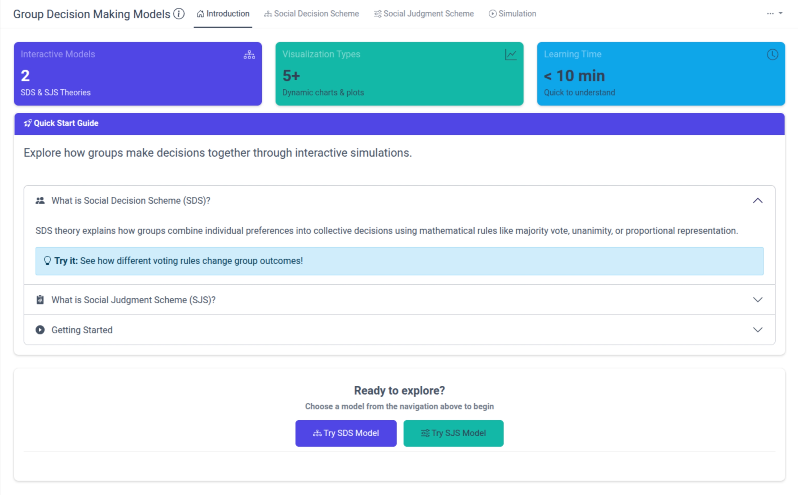

<!-- README.md is generated from README.Rmd. Please edit that file -->

# Consensys 

<!-- badges: start -->

<!-- badges: end -->

**Consensys** is an interactive R Shiny application for exploring,
visualizing, and simulating group decision-making and judgment
processes. Based on foundational theories in group psychology—**Social
Decision Scheme (SDS)** and **Social Judgment Scheme (SJS)**—the app
helps users intuitively understand how individual inputs combine into
collective outcomes.

Whether you’re a researcher investigating group dynamics, an educator
teaching social psychology, or simply interested in learning about
collective decision processes, Consensys provides an accessible platform
for exploring these complex phenomena through interactive simulations
and real-time visualizations.

------------------------------------------------------------------------

## 🚀 Try the App

The app is deployed and accessible at:

🔗 [**Consensys on Posit
Cloud**](https://jrwinget-consensys.share.connect.posit.cloud)

No installation required: Start exploring group decision-making theory
immediately!

------------------------------------------------------------------------

## ✨ Features

-   **Social Decision Scheme (SDS) Modeling**
    -   Visualize and experiment with classic decision rules (e.g.,
        majority, unanimity, proportionality)
    -   Customize decision matrices and explore outcome probabilities
        interactively
    -   Real-time parameter adjustments with instant visual feedback
    -   Support for 2-5 alternatives and flexible group sizes
-   **Social Judgment Scheme (SJS) Simulations**
    -   Model continuous judgments using similarity-based weights and
        confidence levels
    -   Advanced parameter controls including self-weight and decay
        parameters
    -   Explore how distance-based influence affects group consensus
    -   Conduct sensitivity analyses on weighting schemes and group
        consensus thresholds
-   **Dynamic Simulation Engine**
    -   Simulate group decision processes across multiple rounds with
        real-time plots
    -   Real-time controls and updates during simulation
    -   Customize group size, initial positions, and aggregation
        parameters
    -   Interactive visualizations showing convergence patterns and
        group dynamics
-   **Interactive Learning Tools**
    -   Built-in guided walkthrough for new users
    -   Progressive disclosure design for intuitive learning
    -   Contextual help and parameter explanations

------------------------------------------------------------------------

## 🎯 Getting Started

### Online (Recommended)

Explore how groups make decisions through interactive simulations:

<figure>

<figcaption aria-hidden="true">Consensys Landing Page</figcaption>
</figure>

**Quick Start Guide:**

1.  **Launch the App** → [Consensys on Posit
    Cloud](https://jrwinget-consensys.share.connect.posit.cloud)
2.  **Take the Tour** → Click “Take A Guided Tour” for an interactive
    walkthrough
3.  **Choose Your Model:**
    -   **Social Decision Scheme** → Explore rule-based group decisions
    -   **Social Judgment Scheme** → Simulate confidence-weighted
        consensus
4.  **Experiment** → Adjust parameters in real-time and observe instant
    updates
5.  **Learn** → Use collapsible info sections to understand the
    underlying theory

**Learning time:** Under 10 minutes to basic proficiency!

### Local Development

For researchers and developers wanting to explore the models locally or
contribute to development:

    # clone the repository
    git clone https://github.com/jrwinget/consensys.git
    cd consensys

    # install dependencies (if using renv)
    renv::restore()

    # run the demo script to understand decay parameters
    source("man/demo_decay.R")

    # launch the full application
    shiny::runApp()

**System Requirements:** - R (≥ 4.0.0) - Recent web browser (Chrome,
Firefox, Safari, Edge) - Internet connection for initial package
installation

------------------------------------------------------------------------

## 📊 Advanced Features

### SJS Parameter Controls

**Understanding Key Parameters:**

-   **Self Weight (0-1):** Controls how much individuals rely on their
    own position versus others’ influence
    -   Higher values = more individual persistence
    -   Lower values = more susceptible to group influence
-   **Decay Parameter (0.1-5.0):** Determines how quickly influence
    decreases with distance between positions
    -   Lower values (e.g., 0.5): More influence from distant positions,
        greater convergence
    -   Higher values (e.g., 5.0): Less influence from distant
        positions, slower convergence
-   **Group Size (2-10):** Number of individuals in the decision-making
    group
-   **Rounds (1-20):** Number of discussion/influence cycles to simulate

### Real-Time Simulation Features

-   **Dynamic Parameter Adjustment:** Change parameters during
    simulation to see immediate effects
-   **Interactive Visualizations:** Hover over plots for detailed
    information
-   **Convergence Tracking:** Monitor how group positions change over
    time
-   **Statistical Summaries:** View descriptive statistics and consensus
    measures

### Demo Script

The included demo script (`man/demo_decay.R`) allows researchers to: -
Test different decay parameter values systematically - Compare
convergence patterns across parameter settings - Generate reproducible
results for research purposes - Understand the mathematical foundations
of SJS theory

    # example usage of demo script
    source("man/demo_decay.R")
    compare_decay_effects(decay_values = c(0.5, 1.0, 2.0, 5.0))

------------------------------------------------------------------------

## 📚 Academic Background

### Theoretical Foundation

Consensys implements computational models based on seminal work in group
decision-making research:

**Social Decision Schemes (SDS)** describe how groups combine individual
preferences into collective decisions through systematic rules and
procedures. Originally developed by Davis (1973), SDS theory has been
extensively validated across diverse decision contexts.

**Social Judgment Schemes (SJS)** model how groups reach consensus on
continuous judgments through iterative influence processes. This
framework captures the dynamic nature of group deliberation and the role
of confidence in shaping influence patterns.

### Key Applications

-   **Research:** Investigate theoretical predictions about group
    behavior
-   **Education:** Demonstrate complex social psychological concepts
    interactively
-   **Methodology:** Design and validate group decision-making studies
-   **Practice:** Understand real-world group dynamics and decision
    processes

------------------------------------------------------------------------

## 🤝 Contributing

We welcome contributions from researchers, educators, developers, and
users! Consensys thrives on community input and collaboration.

### 🐛 Reporting Issues

Found a bug or have a feature request? Please use our structured issue
templates:

-   **[🐛 Bug
    Report](https://github.com/jrwinget/consensys/issues/new?template=ISSUE_TEMPLATE/01_bug-report.yml)** -
    Report technical issues
-   **[✨ Feature
    Request](https://github.com/jrwinget/consensys/issues/new?template=02_feature-request.yml)** -
    Suggest new functionality
-   **[🔬 Research
    Enhancement](https://github.com/jrwinget/consensys/issues/new?template=03_research-enhancement.yml)** -
    Propose academic improvements
-   **[📖
    Documentation](https://github.com/jrwinget/consensys/issues/new?template=04_documentation-improvement.yml)** -
    Improve user guidance
-   **[⚡ Performance
    Issue](https://github.com/jrwinget/consensys/issues/new?template=05_performance-issue.yml)** -
    Report slowness or optimization needs
-   **[🎓 Academic
    Question](https://github.com/jrwinget/consensys/issues/new?template=06_academic-question.yml)** -
    Ask about theory or methodology

### 💡 Ways to Contribute

**For Researchers & Academics:** - Suggest theoretical enhancements
based on recent literature - Validate model implementations against
published findings - Propose new statistical features or analysis
capabilities - Share use cases and applications in your research

**For Educators:** - Improve educational content and explanations -
Suggest classroom-friendly features - Report accessibility issues -
Share teaching experiences and feedback

**For Developers:** - Fix bugs and improve performance - Enhance user
interface and experience - Add new visualization capabilities - Improve
code documentation and testing

**For Users:** - Report bugs and usability issues - Suggest improvements
to existing features - Share your experiences using Consensys - Help
improve documentation

### 📋 Contribution Guidelines

1.  **Search existing issues** before creating new ones
2.  **Use appropriate issue templates** for different types of
    contributions
3.  **Follow the Code of Conduct** in all interactions
4.  **Include academic justification** for research-related suggestions
5.  **Provide reproducible examples** when reporting bugs
6.  **Write clear, descriptive commit messages**

### 🚀 Development Workflow

    # fork the repository on GitHub
    # clone your fork locally
    git clone https://github.com/YOUR-USERNAME/consensys.git
    cd consensys

    # create a feature branch
    git checkout -b feature/your-feature-name

    # make your changes and test thoroughly
    # commit with clear, descriptive messages
    git commit -m "Add statistical validation for SDS predictions"

    # push to your fork and create a pull request
    git push origin feature/your-feature-name

### 🧪 Testing

Before submitting contributions, please ensure: - All existing tests
pass: `testthat::test_dir("tests/")` - New features include appropriate
tests - The app runs without errors locally - Documentation is updated
as needed

------------------------------------------------------------------------

## 📖 Code of Conduct

This project adheres to the [Contributor Covenant Code of Conduct
v2.1](.github/CODE_OF_CONDUCT.md). By participating, you are expected to
uphold this code. Please report unacceptable behavior to
<contact@jrwinget.com>.

We are committed to providing a welcoming and inclusive environment for
all contributors, regardless of background, experience level, or
identity. This includes:

-   **Respectful Communication:** Be considerate and constructive in
    discussions
-   **Academic Integrity:** Properly attribute ideas and give credit
    where due
-   **Inclusive Environment:** Welcome contributors from all backgrounds
    and disciplines
-   **Professional Conduct:** Maintain high standards in all project
    interactions

------------------------------------------------------------------------

## 📄 License

This project is licensed under the [GPL-3.0 license](LICENSE) - see the
LICENSE file for details.

### Academic Usage

When using Consensys in academic work, please cite:

    Winget, J. R. (2025). Consensys: An Interactive Application for Social Decision 
    and Judgment Schemes. GitHub. https://github.com/jrwinget/consensys

### Third-Party Licenses

This project builds upon: - R Shiny framework (GPL-3) - Bootstrap
styling (MIT) - Various R packages (see DESCRIPTION file for complete
list)

------------------------------------------------------------------------

## 📚 References & Further Reading

### Foundational Literature

-   **Davis, J. H.** (1973). Group decision and social interaction: A
    theory of social decision schemes. *Psychological Review*, 80(2),
    97-125.
-   **Hinsz, V. B., Tindale, R. S., & Vollrath, D. A.** (1997). The
    emerging conceptualization of groups as information processors.
    *Psychological Bulletin*, 121(1), 43-64.
-   **Tindale, R. S., & Kameda, T.** (2000). ‘Social sharedness’ as a
    unifying theme for information processing in groups. *Group
    Processes & Intergroup Relations*, 3(2), 123-140.

### Methodological References

-   **Kerr, N. L., & MacCoun, R. J.** (1985). The effects of jury size
    and polling method on the process and product of jury deliberation.
    *Journal of Personality and Social Psychology*, 48(2), 349-363.
-   **Laughlin, P. R., & Ellis, A. L.** (1986). Demonstrability and
    social combination processes on mathematical intellective tasks.
    *Journal of Experimental Social Psychology*, 22(3), 177-189.

### Contemporary Applications

-   **Mercier, H., & Sperber, D.** (2011). Why do humans reason?
    Arguments for an argumentative theory. *Behavioral and Brain
    Sciences*, 34(2), 57-74.
-   **Sunstein, C. R.** (2006). *Infotopia: How many minds produce
    knowledge*. Oxford University Press.

------------------------------------------------------------------------

## 🙏 Acknowledgments

Special thanks to:

-   **James H. Davis** for foundational Social Decision Scheme theory
-   **R. Scott Tindale** for advancing Social Judgment Scheme frameworks
    and group information processing
-   **Academic collaborators** who provided feedback and validation
-   **The R Core Team** for the R statistical computing environment
-   **Posit** for the Shiny web application framework
-   **Appsilon** for the `{rhino}` package and framework
-   **The open-source community** for tools and inspiration

------------------------------------------------------------------------

## 📞 Support & Contact

-   **Issues & Bug Reports:** [GitHub
    Issues](https://github.com/jrwinget/consensys/issues)
-   **Feature Requests:** [Feature Request
    Template](https://github.com/jrwinget/consensys/issues/new?template=02_feature_request.yml)
-   **Academic Questions:** [Academic Question
    Template](https://github.com/jrwinget/consensys/issues/new?template=06_academic_question.yml)
-   **General Discussion:** [GitHub
    Discussions](https://github.com/jrwinget/consensys/discussions)

For private inquiries or security concerns, please email:
\[<contact@jrwinget.com>\]

------------------------------------------------------------------------

*Last updated: 2025-07-16*
